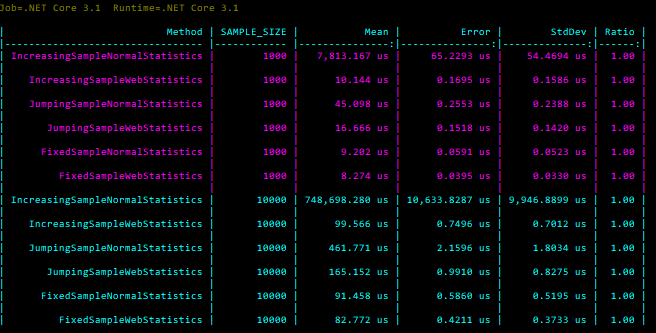

# EdgeStats

Fast statistics for edge computing.

EdgeStats is a library intended for computing statistics with sets that are subject to constant change. This is useful when computing the statistics for the last N samples of a data stream. This library greatly improves the performance of computing statistics on an edge connected device.

## Supported Calulations
Though currently small, the number of calculations provided by this library will grow.

* Mean
* Sample Variance
* Sample Standard Deviation

## Utility
This library provideds the following functionality:

* Adding/removing a sample from a set with O(1) time, while occupying O(1) memory.
* A sliding window class that allows for O(1) maintenance of a fixed sample size set containg the N most recently added samples. This has a memory complexity of O(N).

## Performance
The bellow benchmarks were performed using BenchmarkDotNet and by taking the standard deviation and mean of a set. Increasing sample means the calculations were performed for every new sample added to the set up to SAMPLE_SIZE. Jumping sample means the calculations were performed on a set containing SAMPLE_SIZE samples, then again on a new set containing the old set plus another SAMPLE_SIZE samples. Fixed sample means the set remained unchanged and the calculations were performed only once.



## Usage
### Increasing sample
```csharp
IncrementalStandardDeviation stats = new IncrementalStandardDeviation();

stats.AddSample(1.5);
stats.AddSample(7.6);
stats.AddSample(5.3);

// 2.515287
double standardDeviation = stats.StandardDeviation;
```

### Decreasing sample
```csharp
DecrementalStandardDeviation stats = new DecrementalStandardDeviation();

stats.AddSample(1.5);
stats.AddSample(7.6);
stats.AddSample(5.3);

// 2.515287
double standardDeviation = stats.StandardDeviation;

stats.RemoveSample(7.6);

// 1.9
standardDeviation = stats.StandardDeviation;
```

### Sliding Window
```csharp
const int WINDOW_SIZE = 10;
DecrementalStandardDeviation stats = new DecrementalStandardDeviation();
SlidingWindowStatistics slidingWindowStats = new SlidingWindowStatistics(
    stats, WINDOW_SIZE);

slidingWindowStats.AddSample(1);
...
slidingWindowStats.AddSample(10);

// 2.872281
double standardDeviation = stats.StandardDeviation;

slidingWindowStats.AddSample(15);

// 3.645545
standardDeviation = stats.StandardDeviation;
```

## License
[MIT](https://choosealicense.com/licenses/mit/)
